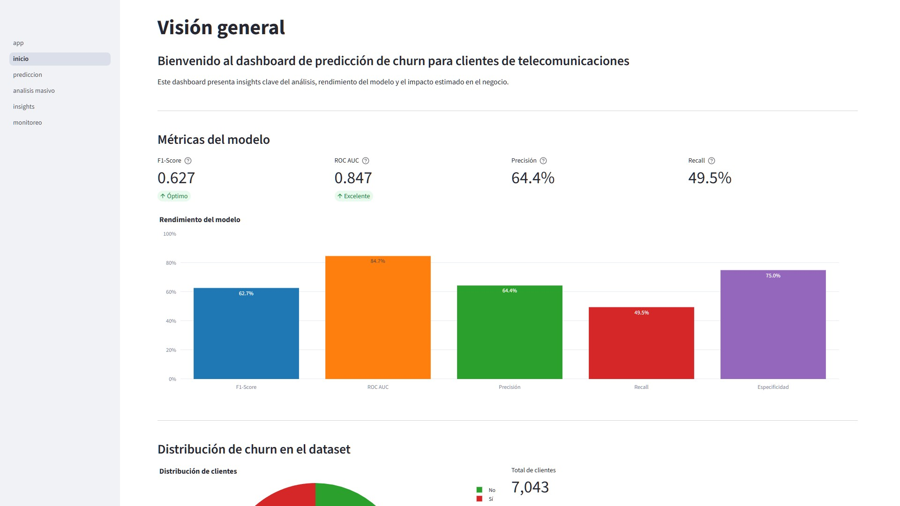
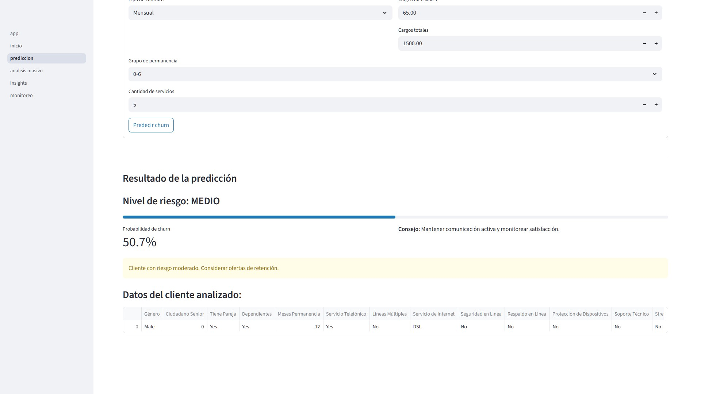
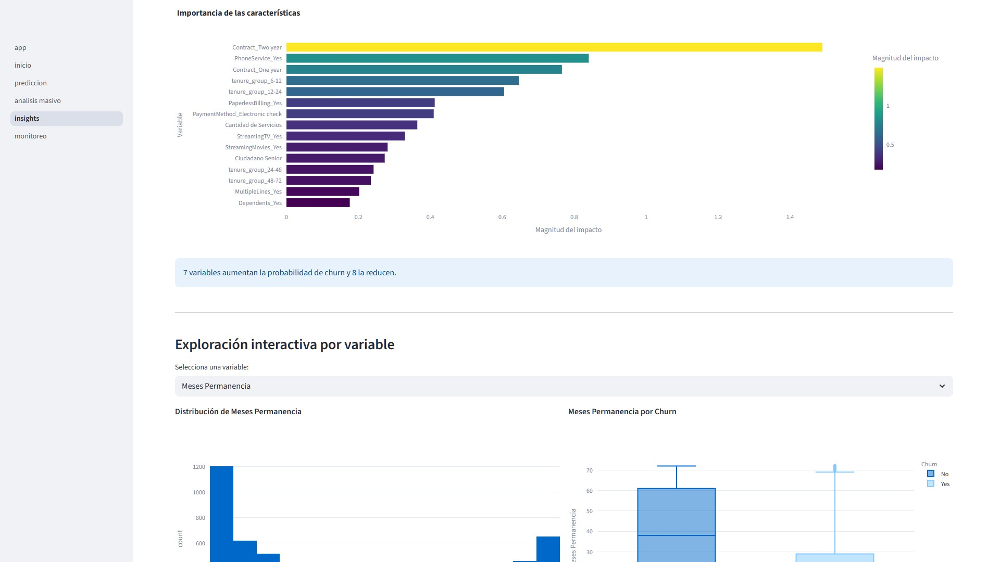
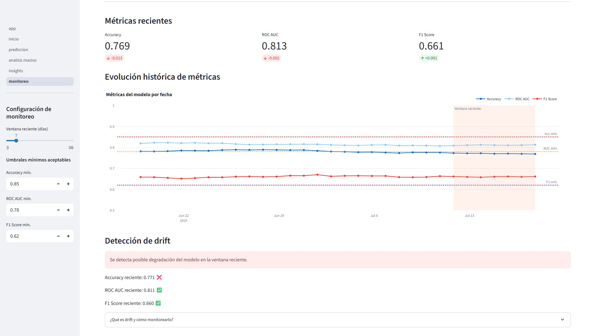

# 📊 Dashboard de Predicción de Churn en Telecomunicaciones

     

Una solución completa para predecir y analizar la pérdida de clientes (churn) en empresas de telecomunicaciones, desde el procesamiento de datos hasta la implementación de un dashboard interactivo listo para negocio.

---

## 📝 Introducción

El abandono de clientes representa uno de los mayores desafíos para las empresas de telecomunicaciones, ya que retener un cliente es significativamente más económico que adquirir uno nuevo.  
Este proyecto resuelve este problema mediante:

- Predicción individual y masiva de probabilidad de churn.
- Segmentación por niveles de riesgo (BAJO, MEDIO, ALTO).
- Insights explicativos sobre las variables más influyentes.
- Monitoreo del modelo en el tiempo con alertas ante posibles drifts.

Enfoque principal: Integrar ciencia de datos + visualización + explicabilidad en una herramienta diseñada tanto para equipos técnicos como de negocio.

---

## 🔍 Flujo del proyecto

Este proyecto cubre todo el ciclo de vida de un modelo de machine learning:

### 1. Preprocesamiento y análisis exploratorio (Notebooks)

- Limpieza y transformación del dataset original.
- Análisis de distribución de variables, correlaciones y patrones de churn.
- Creación de nuevas variables: `tenure_group`, `MultipleServices`.

### 2. Modelado y evaluación

- Entrenamiento de varios modelos: Regresión Logística, Random Forest, XGBoost.
- Optimización con GridSearchCV.
- Métricas clave:
  - F1-Score: 0.63
  - ROC AUC: 0.84
- Modelo final seleccionado: Regresión Logística por su interpretabilidad y desempeño.

### 3. Implementación del dashboard (Streamlit)

Páginas principales:

- Inicio: Resumen ejecutivo y métricas globales.
- Predicción Individual: Análisis detallado de un cliente.
- Análisis Masivo: Predicción para lotes mediante carga de archivo.
- Insights: Importancia de variables y análisis interactivo.
- Monitoreo: Seguimiento histórico del modelo y detección de drift.

---

## 📂 Estructura del proyecto

```plaintext
churn-prediction/
├── README.md                         # Documentación principal
├── requirements.txt                  # Dependencias del proyecto
├── dashboard/                        # Aplicación Streamlit
│   ├── app.py                        # App principal
│   ├── config/                       # Configuración general
│   ├── pages/                        # Páginas del dashboard
│   │   ├── 01_inicio.py
│   │   ├── 02_prediccion.py
│   │   ├── 03_analisis_masivo.py
│   │   ├── 04_insights.py
│   │   └── 05_monitoreo.py
│   └── utils/                        # Funciones auxiliares
├── data/                             # Datos
│   ├── raw/                          # Dataset original
│   │   └── Telco-Customer-Churn.csv
│   └── processed/                    # Dataset limpio
│       └── clean_telco.csv
├── models/                           # Modelos y artefactos
│   ├── churn_model.pkl
│   ├── categorical_columns.pkl
│   ├── feature_names.pkl
│   └── ohe_encoder.pkl
├── notebooks/                        # Notebooks de análisis y modelado
│   ├── 01_preprocessing.ipynb
│   ├── 02_eda.ipynb
│   └── 03_modeling.ipynb
└── reports/                          # Reportes y visualizaciones
    └── figures/
        ├── 02_eda_files/             # Gráficos del análisis exploratorio
        └── 03_modeling_files/        # Gráficos del modelado
```

---

## 📊 Dataset

- Fuente: https://www.kaggle.com/blastchar/telco-customer-churn
- Registros: 7,043 clientes
- Características:
  - Categóricas: Tipo de contrato, método de pago, servicios contratados.
  - Numéricas: Tenure, cargos mensuales y totales.
- Variable objetivo: `Churn` (Sí/No).

---

## ⚙️ Tecnologías utilizadas

- Python 3.10.11
- Librerías:
  - Pandas 2.3.1, NumPy 2.2.6
  - Scikit-learn 1.6.1, XGBoost 3.0.2, imbalanced-learn 0.13.0
  - Plotly 6.2.0, Seaborn 0.13.2
- Frontend: Streamlit 1.47.0
- Monitoreo: Simulación con métricas históricas (ROC AUC, F1, Accuracy).

---

## 🚀 Ejecución local

1. Clona el repositorio:  
   git clone https://github.com/ax-zar/churn-model-dashboard.git
   cd churn-dashboard

2. Crea y activa un entorno virtual (recomendado):

   - En Windows:  
     python -m venv venv  
     .\venv\Scripts\activate

   - En macOS/Linux:  
     python3 -m venv venv  
     source venv/bin/activate

3. Instala las dependencias:  
   pip install -r requirements.txt

4. Ejecuta la aplicación:  
   streamlit run dashboard/app.py

---

## 📈 Rendimiento del modelo

| Modelo              | F1-Score | ROC AUC |
| ------------------- | -------- | ------- |
| Regresión Logística | 0.6273   | 0.8466  |
| Random Forest       | 0.5566   | 0.8260  |
| XGBoost             | 0.5804   | 0.8351  |

Se seleccionó Regresión Logística por su balance entre precisión y explicabilidad.

---

## 🔗 Recursos

- Dataset: https://www.kaggle.com/blastchar/telco-customer-churn
- Repositorio GitHub: https://github.com/ax-zar/churn-model-dashboard
- LinkedIn: https://www.linkedin.com/in/axzar/

---

## 📷 Capturas del dashboard

Página de inicio


Predicción individual


Análisis masivo


Insights


Monitoreo

